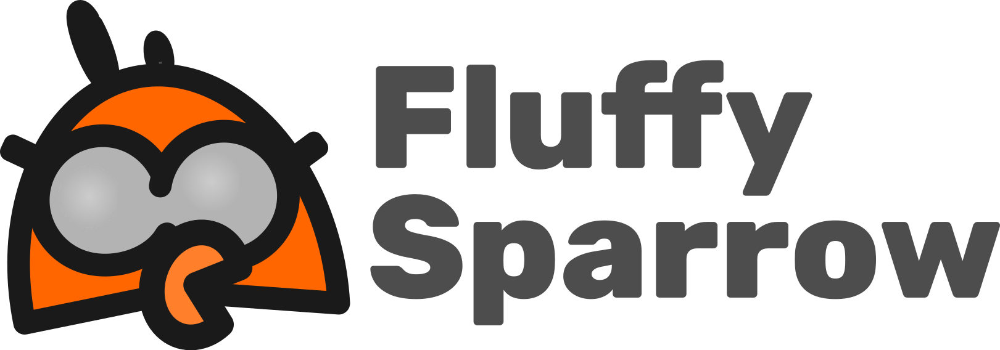
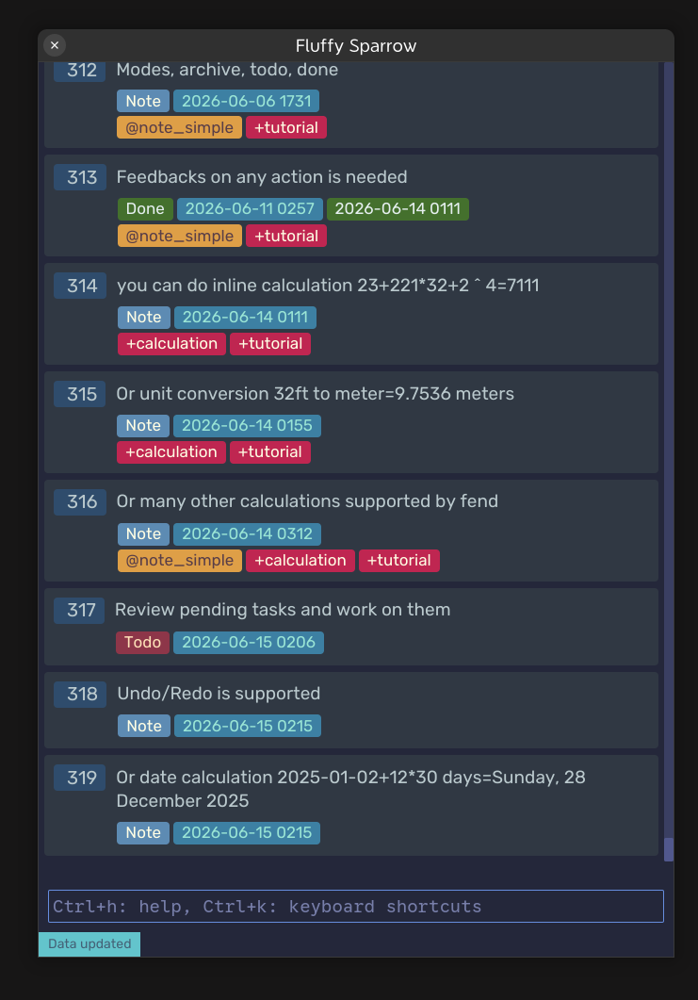
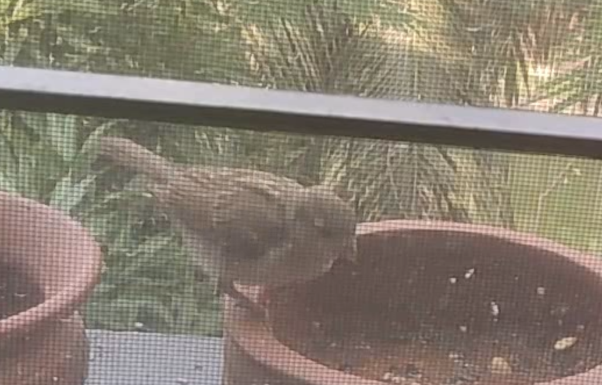
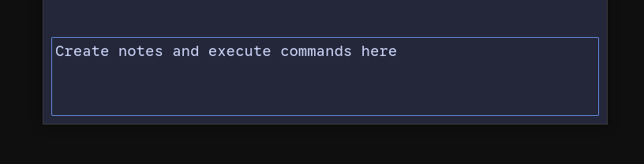
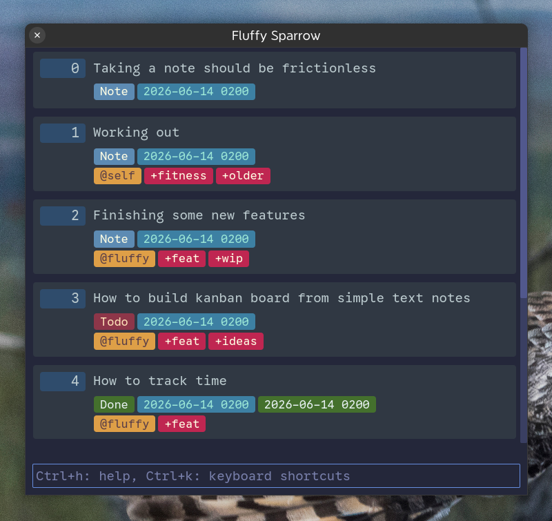
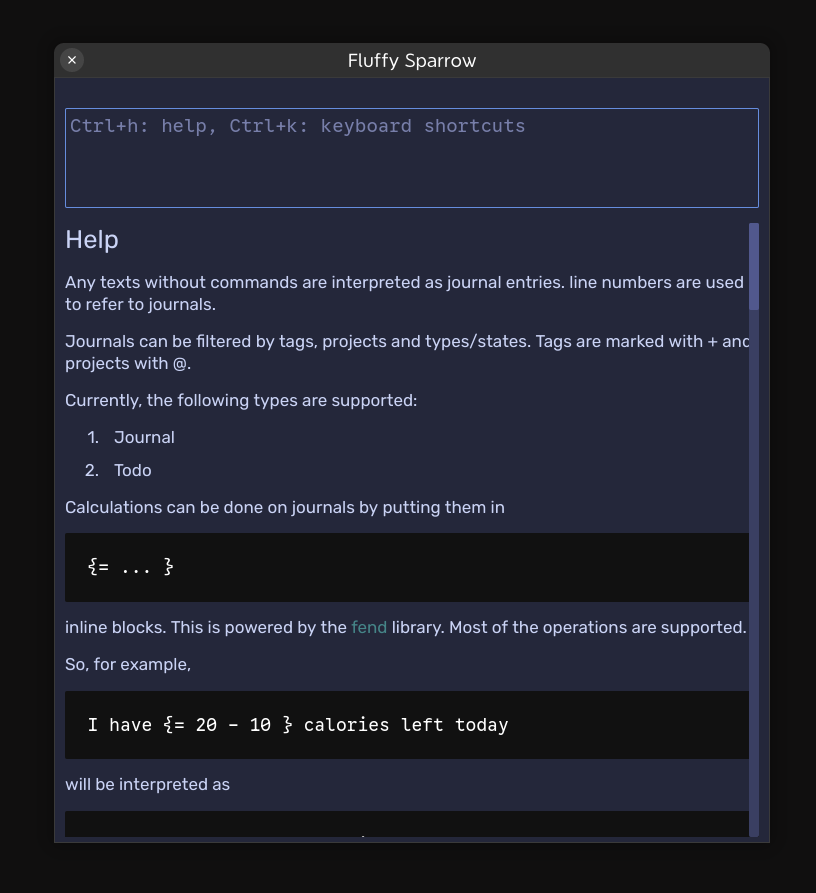
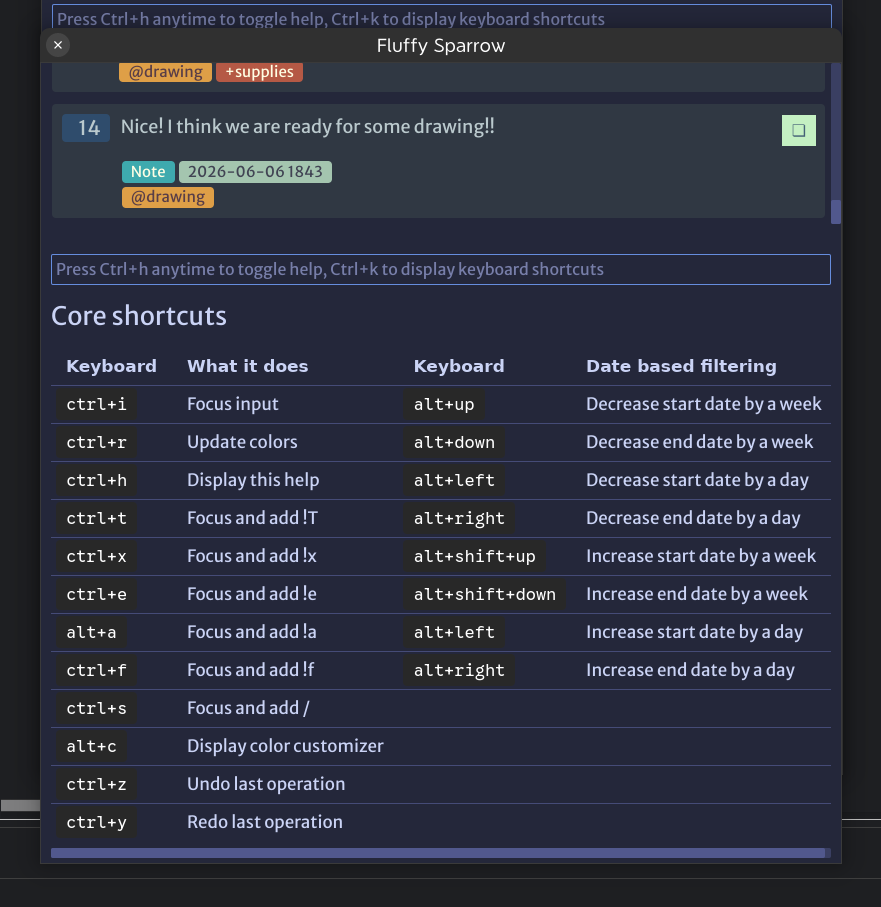
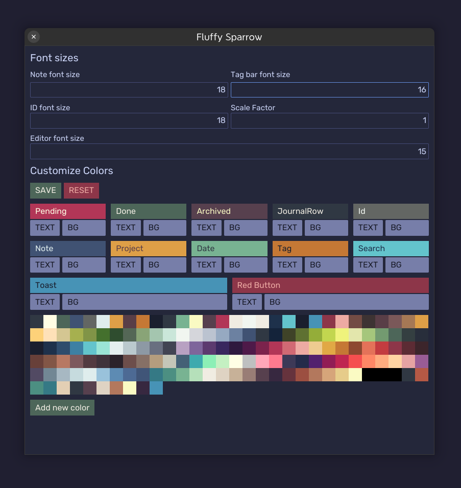
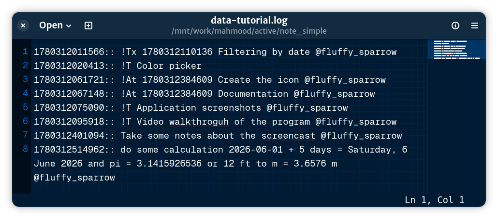

There are many notes applications in the wild. But each one scratches different itches, and this one looks to take care of some, by being extremely simple, frictionless, minimalistic, while still packing quiet the punch.

<video width="842" height="888" controls>
  <source src="static/images/fluffy_sparrow.mp4" type="video/mp4">
</video>

## Fluffy Sparrow?

The name comes from this tiny guest, a baby house sparrow, that came for food on the window next to me. It's fluffy, tiny, adorable, but also quick and pretty clever.

So, what this Fluffy Sparrow (FS) can do to deserve the same name? Let's see!

The most important part of a note app is taking notes. And FS can make it quick and simple as open the app, type the note and enter, and done!

That's all you have to do! All the operations are simply done from this single text input.

It does its best to be as frictionless as possible.

But you can do a lot from a single text input!

Like writing down your todo, marking them done, do many kinds of calculations quickly, search by text or filter by date range, unlimited undo. You can add tags or organize notes/todo in projects, archive unnecessary ones. 

Documentation, and context-sensitive help is available by pressing `Ctrl+H`.

And all actions can be performed by keyboard shortcuts 

Also, you can customize how the app looks from the app itself, with the color scheme customizer. Make it your own.

FS's core principle is making journaling as frictionless as possible. And, a lot of thought is put in to making it so, and still being done. It's handcrafted, without any LLM, and with a lot of care.

And many more features are coming! Like Time tracking, scripting, etc., with only one time purchase, that will cost you less than a month of coffee.

And now about the big fluffer in the room! Your data.
And, FS have you covered here too!

Data is stored in text format, on your device and completely open. Even in 100 years, or tomorrow, if this developer falls under the bus, you will have the application as long as you want. The format is easy to navigate and searchable using *nix commands.

It has no online features, no intention to have any; In the future, You can expect to have online interaction, through scripts written by you, but not the app itself.

And having no 3rd party dependency, the app should not have any issues running on the intended platforms, which are now Linux, and Windows. I do not have a Mac, so no Mac support, yet.

## Features

- Quickly create and edit single-line journals
- Filter by projects and tags
- Search journals
- Inline calculation
- TODO management
- Data are in plain text format, easy to navigate and search
- No external dependencies
- Lightweight, and minimal interface, fully customizable theme
